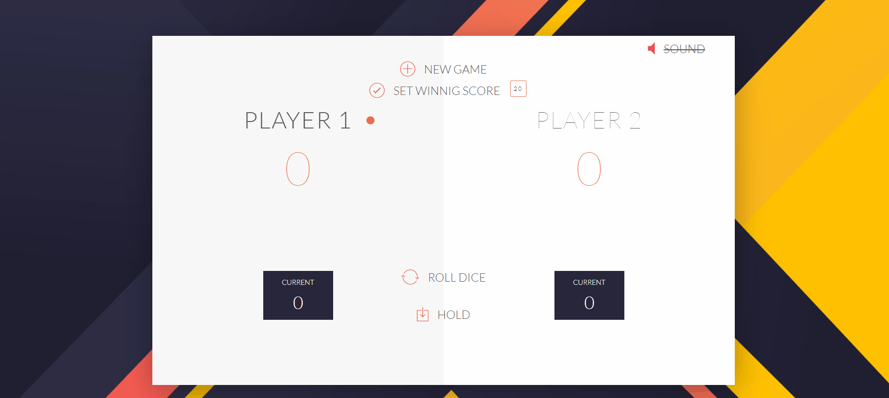

<div style="text-align:center"></div>
<div align=center>:blue_heart::heart::green_heart: <span style="color:blue; font-family: 'montserrat';">PIG</span> <span style="color:red; font-family: 'montserrat';">DICE</span> <span style="color:green; font-family: 'montserrat';">GAME</span> :green_heart::heart::blue_heart:</div>  

<div align=center><span style="color:#000; font-family: 'montserrat';">Thanks for visinting my repo ! </span></div>

<div style="text-align:center"></div>


<span style="color:#000; font-family: 'montserrat';">I think its good to see the rules if you dont know about it :</span>

[Youtube video](https://www.youtube.com/watch?v=gMFMpC3mC_0)


<span style="color:#000; font-family: 'montserrat';">This repo is about a simple dice game created using HTML, CSS and JavaScript.
Here we are explaining the main lines in this project :
</span>

<span style="color:#f50; font-family: 'montserrat';">1. HTML :</span>
```html
<link href="https://fonts.googleapis.com/css?family=Lato:100,300,600" rel="stylesheet" type="text/css">
```
<span style="color:black; font-family: 'montserrat';">This tag will link and reference the google fonts with this project.</span>
```html
<link href="http://code.ionicframework.com/ionicons/2.0.1/css/ionicons.min.css" rel="stylesheet" type="text/css">
```
<span style="color:black; font-family: 'montserrat';">
This tag will link and reference the Icons will use in this project from : <a href='https://ionicframework.com'>ionicframework.com</a>. <br>
</span>

```html
<body onload="startSoundOnLoad()">
```
<span style="color:black; font-family: 'montserrat';">The onload attribute allow the starting of the background music immediately after the browser finishes loading the website.</span>

```html
<button class="btn-new" onclick="newGame()"><i class="ion-ios-plus-outline"></i>New game</button>
<button class="btn-roll" id="btnroll" onclick="rollTheDice()"><i class="ion-ios-loop"></i>Roll dice</button>
<button class="btn-hold" onclick="hold()"><i class="ion-ios-download-outline"></i>Hold</button>
<button class="scoreLable" onclick="setWinningScore()" id="winbtn"><i class="ion-ios-checkmark-outline"></i>Set winnig score</button>
<button class="sound" onclick="startSound()" id="soundbtn"> <i class="ion-ios-volume-high"></i> Sound</button>
```
<span style="color:black; font-family: 'montserrat';">All the buttons have the "onclick" attribute that allows the tag behave with a specific behaviours that is implemented in Js.</span>

<span style="color:blue; font-family: 'montserrat';">2. CSS :</span>

```css
* {
    margin: 0;
    padding: 0;
    box-sizing: border-box;
}
```
<span style="color:black; font-family: 'montserrat';">The asterisk * means that all the elements of html will effect with this changes.</span>


```css
.clearfix::after {
    content: "";
    display: table;
    clear: both;
}
```
<span style="color:black; font-family: 'montserrat';">-The <code>content</code> property is used with the <code>::before</code> and <code>::after</code> pseudo-elements, to insert generated content, and here we leave it empty.
-The <code>display</code> property specifies the display behavior (the type of rendering box) of an element.
-The <code>clear</code> property specifies on which sides of an element floating elements are not allowed to float.</span>

```css
button {
    position: absolute;
    width: 200px;
    left: 50%;
    transform: translateX(-50%);
    color: #555;
    background: none;
    border: none;
    font-family: Lato;
    font-size: 20px;
    text-transform: uppercase;
    cursor: pointer;
    font-weight: 300;
    transition: background-color 0.3s, color 0.3s;
}
```
<span style="color:black; font-family: 'montserrat';">-The <code>transform</code> property applies a 2D or 3D transformation to an element. This property allows you to rotate, scale, move, skew, etc., elements.
-The <code>translateX()</code> function repositions an element horizontally on the 2D plane.
-The <code>cursor</code> property specifies the mouse cursor to be displayed when pointing over an element.
-The <code>transition</code> property allows you to change property values smoothly, over a given duration.</span>

```css
button:hover { font-weight: 600; }
```
<span style="color:black; font-family: 'montserrat';">-The <code>:hover</code> selector is used to select elements when you mouse over them.</span>

```css
button:focus { outline: none; }
```
<span style="color:black; font-family: 'montserrat';">
-The<code>:focus</code> selector is used to select the element that has focus.</span>

```css
@keyframes move{
    0%{
        transform: scale(1) rotate(0deg);
    }
    25%{
        transform: scale(1.5) rotate(5deg);
    }
    50%{
        transform: scale(1) rotate(00deg);
    }
    75%{
        transform: scale(1.5) rotate(-5deg);
    }
    100%{
        transform: scale(1) rotate(0deg);
    }
}
```
<span style="color:black; font-family: 'montserrat';">
-The<code>@keyframes</code> rule specifies the animation code,
The animation is created by gradually changing from one set of CSS styles to another,During the animation, you can change the set of CSS styles many times.</span>

<span style="color:orange; font-family: 'montserrat';">2. JavaScript :</span>

```javaScript
document.getElementById("DiceImg1").style.display = "none";
```
<span style="color:black; font-family: 'montserrat';">
It takes the tag that has the "DIceImg1" and change its CSS style display to "none" and that will disapear that tag in html.</span>

```javaScript
var myMusic = new Audio("8bit.mp3");
```
<span style="color:black; font-family: 'montserrat';">
Here the creation of the audio Object.</span>

```javaScript
function rollTheDice()
```
<span style="color:black; font-family: 'montserrat';">
It's the core of the game, it has the principles instructions of the game .</span>
```javaScript
function rollTheDice()
```
<span style="color:black; font-family: 'montserrat';">
It's the core of the game, it has the principles instructions of the game .</span>
```javaScript
var rolledNumber = (Math.floor(Math.random() * 6)) + 1;
```
<span style="color:black; font-family: 'montserrat';">
Here we create the random value from 1 to 6 using <code>Math.random()</code> function to generate the random number and <code>Math.floor()</code> to Round a number downward to its nearest integer.</span>

```javaScript
if (rolledNumber == 1) 
{
    document.getElementById("DiceImg1").style.display = "none";
    document.getElementById("DiceImg2").style.display = "none";
    document.getElementById("current-0").innerHTML = 0;
    document.getElementById("player-1").className = "player-1-panel active";
    document.getElementById("player-0").classList.remove("active");
    roundScore = 0;
    turn = 'Player2';
}
```
<span style="color:black; font-family: 'montserrat';">
-The <code>document.getElementById("current-0").innerHTML = 0;</code> changes the text of a tag that has "current-0" id. <br>
-The<code>document.getElementById("player-1").className = "player-1-panel active";</code> insert a CSS class to a tag that has the id of "player-1".</span>


```javaScript
function newGame()
```
<span style="color:black; font-family: 'montserrat';">
-The function will reset the game and start a new game. </span>

```javaScript
function hold()
```
<span style="color:black; font-family: 'montserrat';">
-The function will save the the current score and print it in the global score. </span>


```javaScript
function change(diceImg, dice, current)
```
<span style="color:black; font-family: 'montserrat';">
-The function will change the dice image. </span>


```javaScript
function startSound() 
```
<span style="color:black; font-family: 'montserrat';">
-The function will start the sound or stop it in onclick event. </span>

```javaScript
function startSoundOnLoad()
```
<span style="color:black; font-family: 'montserrat';">
-The function will start the sound when the page finishes loading. </span>

```javaScript
function setWinningScore()
```
<span style="color:black; font-family: 'montserrat';">
-The function will SET the winning score game as the user desire. </span>
